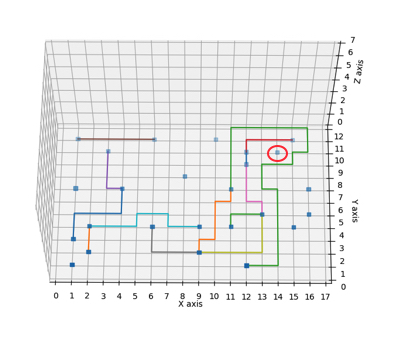

# Chips-Circuits
Teamname
Jop, Navisa & Robel

## De opdracht
Verbind gates met een vaste locatie met elkaar volgens de netlists. De positie van de gates en welke connecties gemaakt moeten worden zijn van tevoren verkregen.

Connecties kunnen alleen het rooster volgen. Dit bevat ook de rand van het rooster. 1 stap kost 1 eenheid.

Het rooster bestaat uit 7 lagen. Dit betekent dat de connecties ook omhoog en omlaag kunnen. Dit kost 1 eenheid per level.

Alle connecties tussen de gates moeten gelegd worden met een zo laag mogelijke kostenplaatje.

In het plaatje is te zien in 2D hoe de connecties A-B, A-C,C-E, D-B, D-E gemaakt worden met zo weinig mogelijk stappen.

## Constraints:
- De lijnen mogen niet langs dezelfde route gaan
- De lijnen mogen elkaar niet kruisen
- De lijn mag niet buiten de grid komen, 17x12 voor print 1 en 17x16 voor print 2

## Werkwijze:
Voor deze opdracht is er gebruikt gemaakt van het A* algoritme. (uitleg algoritme)

##Aanpassingen:
Tijdens het generenen van de connecties werden niet alle connecties gemaakt. Dit kwam omdat eerdere gemaakte connecties sommige gates afsluitte waardoor er geen connecties gemaakt konden worden met die gates. Dit is te zien in de afbeelding hieronder met de desbetreffende gate omcirkelt in rood.

Om dit probleem op te lossen, zijn de volgende aanpassingen gedaan.

© 2019 All Rights Reserved
