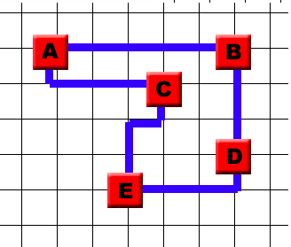

# Chips & Circuits
Chips are made out of silicone plates. You can find gates on these plates which interact with each other by connecting them. By connecting them with each other, electricity can flow between the gates & a circuit is created. You can connect gates in various ways, whereby a netlist shows which gates should be connected to each other. However it doesn't show how the gates should be connected to each other.

The assignment is to connect gates with a fixed arrangement with each other according to a given netlist.
Connections can only follow the grid. This includes the edge of the grid. 1 step on the grid is one unit length.
The grid exists of 7 layers. This means that connections can also go up and down. This costs 1 unit length per level.
All connections of each netlist needs to be made at minimum cost.

The example below shows how the connections A-B, A-C,C-E, D-B, D-E are being made with as little steps as possible.


 ### Constraints

 - Wires can not run along the same grid segment
 - Wires can not cross at an intersection
 - Wires can not go outside of the grid, 17x12 for print 1 and 17x16 for print 2

## Prerequisites
This code has been written in [Python3.7.5](https://www.python.org/downloads/). In requirements.txt are all the required packages to successfully use the code. This includes the matplotlib and json packages. These can be downloaded by following the following function:
```bash
pip install -r requirements.txt
```

## Structure
In the code folder you can find the algorithms and classes folders.
You can find the pathfinding algorithms **breadth first**, **a-star** and **hillclimber** in the algorithms folder.

You can find the print & netlist file in the classes folder.
The **netlist** file loads the netlist that is selected with the manhattan distance per connection & the **print** file loads the gates with their corresponding coordinates.
The **netlist** file also contains some helping functions that are used in the 3 algorithms.

The pics folder contains all the pictures used in the README.md file

The gates&netlists folder contains 2 folders: **chip_1** & **chip_2**. Each of these folders contain all the netlists and gate positions of the corresponding chip. Chip 1, netlist 0 is our own made netlist for the testing of Breadth First.

The results folder contains the results obtained from running the program depending on which netlist you choose.

For more information on these files, click on them.

## Algorithms
For this problem 3 algorithms were used:
* A*
* Hillclimber
* Breadth First

Due to the A*-algorithm pushing the connections up to make all connections, the wire length becomes unnecessary long by not using the lower levels. The Hillclimber algorithm improves the solution found by A* by recreating the made connections on the lower levels.

**Heuristic**

The netlists are sorted by the average amount of connections coming to or from the gate

## Testing
To use this code you first run:
```bash
python main.py
```
After choosing your preferred algorithm. You can choose A for A*, B for Breadth first. Further you will be asked to choose between chip 1 and 2 and then for a netlist. 0-3 for chip 1 and 4-6 for chip 2. The code will now look for a solution for the chosen netlist.

Option C for Hillclimber can be chosen after first running either A* or Breadth First first. The Hillclimber algorithm will try to lower the connection cost of the already made netlist by A* or Breadth First if possible. You are asked for the length of the result you wish to perform hillclimber on. Note that you should pick the correct print, netlist, and length, or it will not work.

Below an example of the results given by A* and after running that solution through Hillclimber
 

At the end of each search a window will pop up with a visualisation of the found solution containing all gates and the connections between them as shown above.

## Authors
Robel Haile, Jop Meijer & Navisa Rajabali

## Acknowledgments
Minor programming of the UvA

© 2019 All Rights Reserved
